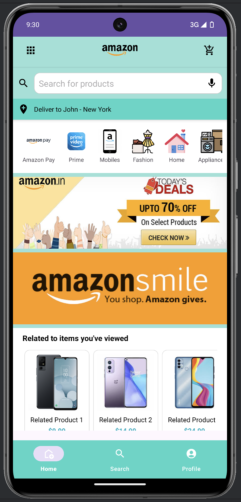
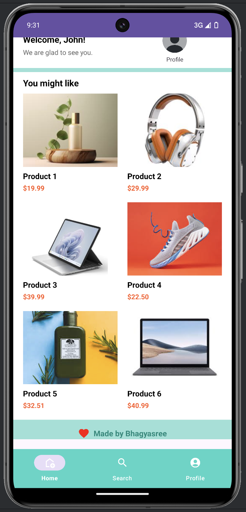
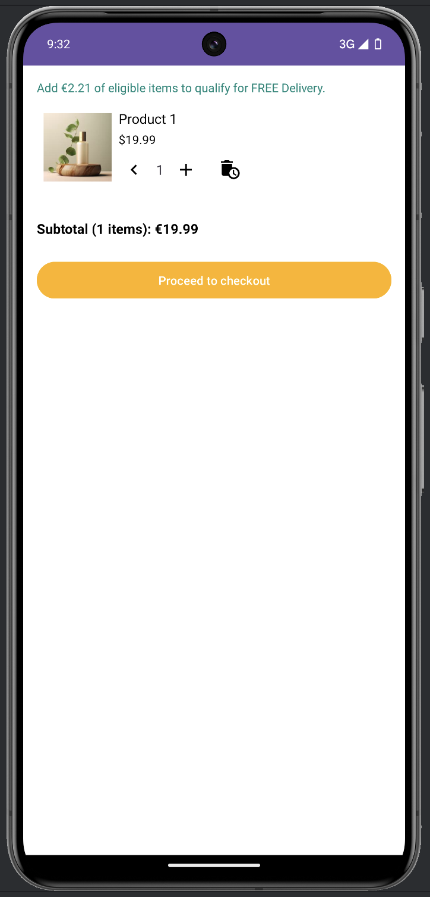
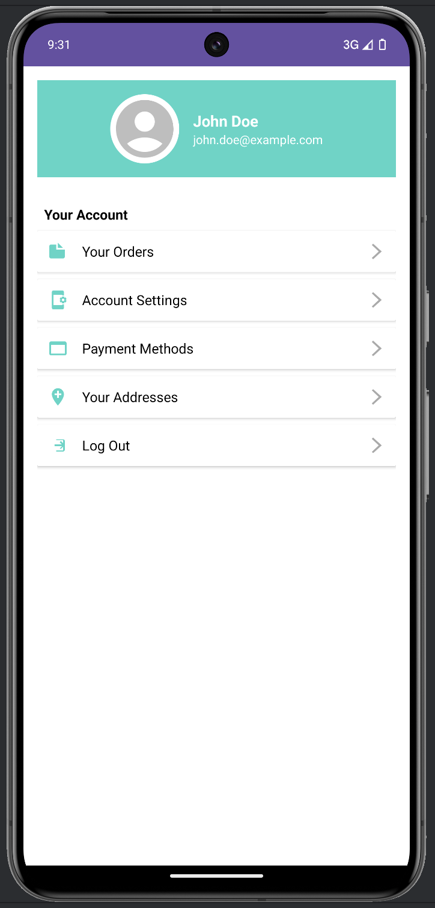
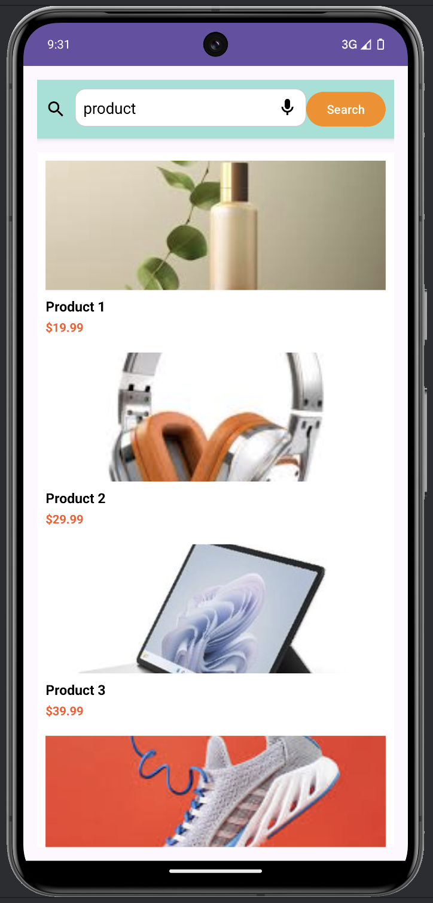

# Amazon Clone

An Android application replicating essential features of an e-commerce platform. This application allows users to browse products, view details, manage a shopping cart, and interact through product comments.

## Table of Contents

- [Features](#features)
- [Tech Stack](#tech-stack)
- [Modules](#modules)
  - [MainActivity](#mainactivity)
  - [CartActivity](#cartactivity)
  - [ProductDetailsActivity](#productdetailsactivity)
  - [ProfileActivity](#profileactivity)
  - [SearchActivity](#searchactivity)
  - [CartAdapter](#cartadapter)
  - [CommentsAdapter](#commentsadapter)
  - [ProductAdapter](#productadapter)
  - [CartManager](#cartmanager)
- [Setup and Installation](#setup-and-installation)
- [Usage](#usage)
- [Screenshots](#screenshots)

## Features

- **Product Listing:** View a list of products with details like images, names, and prices.
- **Product Details:** Display detailed information about a selected product.
- **Search Functionality:** Search products by name.
- **Shopping Cart:** Add or remove products from the cart.
- **Comments Section:** View and add comments to products.
- **User Profile:** Placeholder for user profile management.

## Tech Stack

- **Language:** Kotlin
- **Framework:** Android
- **Libraries:** 
  - **Glide** - for image loading and caching
  - **RecyclerView** - for displaying product lists and comments

## Modules

### MainActivity

Sets up the main product listing screen with a grid view of products, bottom navigation for key sections, and a horizontal display for suggested products.

### CartActivity

Manages the shopping cart where users can view items added, adjust quantities, remove items, and see the total price.

### ProductDetailsActivity

Displays detailed product information, including an image, price, comments, and a list of similar products.

### ProfileActivity

Placeholder for user profile management; layout set up for future user-related functionalities.

### SearchActivity

Allows users to search for products by name, filtering and displaying relevant products in a RecyclerView.

### CartAdapter

Adapter for managing and displaying cart items. Includes quantity controls, item removal options, and updates for total price calculations.

### CommentsAdapter

- **Description:** Adapter for managing comments on products within ProductDetailsActivity.
- **Key Functions:**
  - **ViewHolder Structure:** Holds references to `commenterNameTextView`, `commentTextView`, and `commentDateTextView` for binding data.
  - **onCreateViewHolder:** Inflates the `item_comment.xml` layout for each comment.
  - **onBindViewHolder:** Binds each `Comment` data to the views.
  - **getItemCount:** Returns the total number of comments, displaying each in the order they are listed in the `commentsList`.

### ProductAdapter

- **Description:** Adapter for displaying products within lists, like in the main product listing and search results.
- **Key Functions:**
  - **onCreateViewHolder:** Inflates `item_product.xml` for each product.
  - **onBindViewHolder:** Binds product data (name, price, image) using Glide for image loading.
  - **updateProducts:** Allows dynamic updating of the `productList` based on user actions like search filtering.
  - **ViewHolder Structure:** Holds `productImage`, `productName`, and `productPrice` for binding data and handling click events.

### CartManager

Singleton object for managing the cart contents, including methods for adding, removing, and clearing items.

## Setup and Installation

1. Clone the repository:
   ```bash
   git clone https://github.com/your-username/amazon-clone.git
2. Open the project in Android Studio.
3. Build the project to resolve dependencies.
4. Run the app on an Android device or emulator.

## Usage

1. Launch the app.
2. Browse products on the main screen.
3. View product details by tapping a product.
4. Add to cart from the product details screen.
5. Search for products in `SearchActivity`.
6. View and manage your cart in `CartActivity`.

## Screenshots

### Home Screen



### Product Details Screen


### Cart Screen


### Profile Screen


### Search Screen

